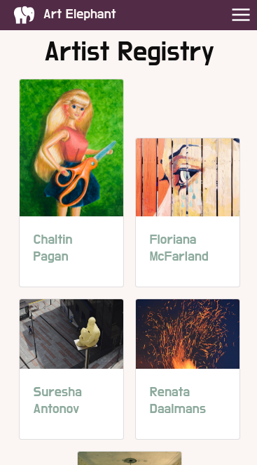

# Art Elephant

## About 
**Art Elephant** is an artist registry that aims to connect visual artists with curators, collectors, and art lovers. 

One way **Art Elephant** distinguishes itself is in the use of Google Maps. An artist's studio location is accurately displayed on the map. With this service,we hope to encourge our users to arrange for a studio visit. 

Source: [Wikipedia](https://commons.wikimedia.org/wiki/File:Descriptive_Zoopraxography_Elephant_Ambling_Animated_13.gif)

## Features
* User Accounts
    * Add and update your artist profile
* Artist Profiles
    * Slideshow of images
    * List your medium 
    * Artist Statement
    * Studio Location on a Google Map
    * Contact Form
* Responsive Web Design (mobile-compatible)

## Future 
* Community Building
    * Opportunities Page
* Expanding the Market
    * Engage with people from other arts disciplines
* Increasing User Engagement
    * Allow users to store a list of favorites
    * Filter artist registry for specific searches
    * Enable private messaging
* Integrating More APIs
    * Google Maps Directions API
        * Directions for various modes of transportation
    * Artsy Public API
        * Link to a visual artist's Artsy profile (if applicable)
        * Explore an artist's 'genes'

## Technology
* React
* Bootstrap
* Google Maps APIs
    * Google Geocoding API
    * Google Maps Javascript API (used by [Google Map React](https://github.com/google-map-react/google-map-react))
* PostgreSQL
* Express JS
* Node JS

## Installation
1. Download this repository.
2. Obtain an [API key](https://cloud.google.com/maps-platform/) from Google Maps. An API key is required for Google Maps to work.
    * In your [Google API console](https://console.cloud.google.com/apis/), create a project.
        * Enable Maps Javascript API.
        * Enable Geocoding API.
    * Create an **app-env.js** file and save to `art-elephant/client/src/components`.
    * In this file, write `export const GOOGLE_API_KEY = "YOUR_API_KEY"`.
3. Seed the database using PostgreSQL.
    * Seed file is located in `art-elephant/db/artElephant.sql`.
4. Start the back-end. (new terminal)
    * `cd art-elephant`
    * `npm start` 
    * Backend uses nodemon.
5. Start the front-end. (new terminal)
    * `cd art-elephant/client`
    * `npm start`

## Screenshots

